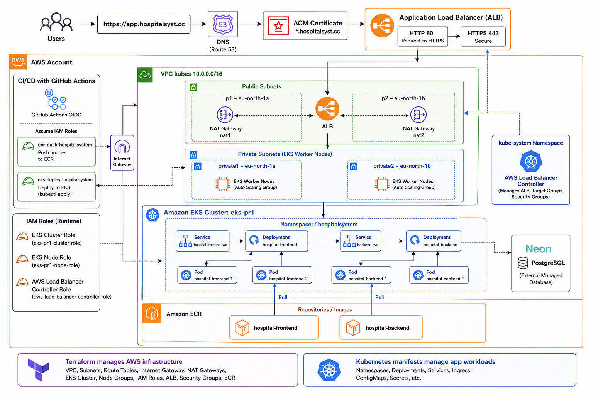
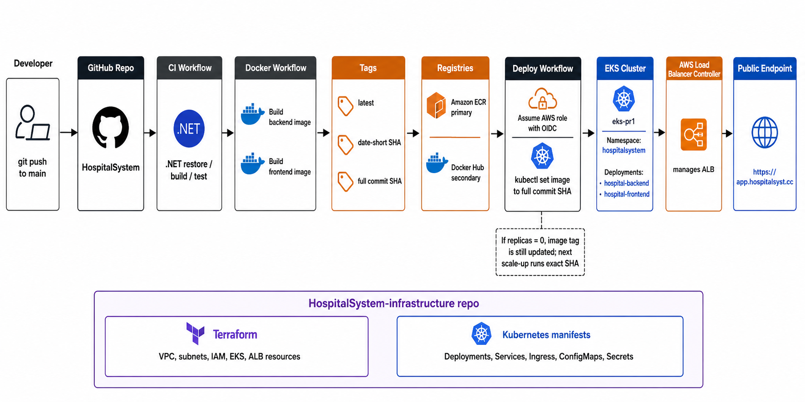

# HospitalSystem Infrastructure

Infrastructure and Kubernetes deployment configuration for:

[KaanMyumyun/HospitalSystem](https://github.com/KaanMyumyun/HospitalSystem)

Current AWS deployment target:

- Public app URL: `https://app.hospitalsyst.cc`
- Runtime platform: Amazon EKS
- Container registry: Amazon ECR
- Ingress: AWS Application Load Balancer
- HTTPS: AWS Certificate Manager
- Database: Neon PostgreSQL
- Frontend API base: `/api`

## Architecture



The application runs on Amazon EKS inside a custom VPC. Public traffic enters
through an AWS Application Load Balancer managed by the AWS Load Balancer
Controller. The ALB terminates HTTPS with ACM and routes:

- `/api` to the backend service
- `/` to the frontend service

Backend and frontend images are built in the application repository and pushed
to Amazon ECR. The database is hosted separately on Neon PostgreSQL.

## AWS Resources

Main AWS resources used by this deployment:

| Area | Resources | Purpose |
| ---- | --------- | ------- |
| Network | VPC `kubes` with CIDR `10.0.0.0/16` | Isolated AWS network for the EKS deployment. |
| Public subnets | `p1` `10.0.0.0/20` in `eu-north-1a`, `p2` `10.0.16.0/20` in `eu-north-1b` | Host internet-facing resources such as the ALB and NAT gateways. Tagged for Kubernetes external load balancers. |
| Private subnets | `private1` `10.0.32.0/20` in `eu-north-1a`, `private2` `10.0.48.0/20` in `eu-north-1b` | Host EKS worker nodes and application pods away from direct public internet exposure. Tagged for internal Kubernetes load balancers. |
| Routing | Internet gateway, public route table, private route tables, NAT gateways, and Elastic IPs | Public subnets route through the internet gateway. Private subnets route outbound traffic through NAT gateways. |
| Compute | Amazon EKS cluster `eks-pr1`, managed node group `hospitalsystempr1`, Amazon Linux 2023 worker nodes | Runs the Kubernetes control plane and worker capacity for the app. The node group is sized for low-cost testing and can scale to zero. |
| Containers | Amazon ECR repositories for `hospital-backend` and `hospital-frontend` | Stores backend and frontend images built by GitHub Actions. |
| Ingress | AWS Application Load Balancer, HTTP/HTTPS listeners, target groups, and AWS Load Balancer Controller | Exposes the app publicly and maps Kubernetes Ingress rules to AWS load-balancing resources. |
| TLS | AWS Certificate Manager certificate | Provides HTTPS for `app.hospitalsyst.cc`; HTTP traffic redirects to HTTPS. |
| Identity | IAM roles and policies for EKS, worker nodes, AWS Load Balancer Controller, GitHub Actions OIDC, ECR push, and EKS deployment | Allows AWS services, Kubernetes components, and CI/CD workflows to use AWS resources without long-lived access keys. |

Traffic flow:

```text
User
  -> https://app.hospitalsyst.cc
  -> AWS Application Load Balancer in public subnets
  -> Kubernetes Ingress managed by AWS Load Balancer Controller
  -> frontend service for /
  -> backend service for /api
  -> backend connects to Neon PostgreSQL
```

## Repository Contents

```text
terraform/
├── *.tf
└── imports/        # ignored unedited Terracognita output
kubernetes/
├── namespace.yaml
├── rbac/
│   └── github-actions-deploy.yaml
├── backend/
│   ├── configmap.yaml
│   ├── deployment.yaml
│   └── service.yaml
├── frontend/
│   ├── deployment.yaml
│   └── service.yaml
└── ingress/
    └── ingress.yaml
```

The Kubernetes manifests define:

- `hospitalsystem` namespace
- backend Deployment and Service
- frontend Deployment and Service
- namespace-scoped RBAC for the GitHub Actions deploy role
- ALB-backed Ingress for `app.hospitalsyst.cc`
- HTTPS listener using ACM
- `/api` routing to the backend
- `/` routing to the frontend

The AWS infrastructure was first created by hand while learning the deployment
flow. After it was working, Terracognita was used to reverse engineer the live
resources into Terraform so the setup could be ported without manually typing
every resource from scratch. The generated output was then split and cleaned
into readable Terraform files. The raw Terracognita output is kept under
`terraform/imports/` locally and ignored by Git.

Terraform manages the AWS infrastructure layer:

- VPC networking
- subnets and route tables
- NAT and internet gateway resources
- security groups
- IAM roles and policies
- EKS cluster and node group
- imported/load-balancer-related AWS resources where appropriate

Kubernetes manages the workload layer:

- `hospitalsystem` namespace
- backend Deployment and Service
- frontend Deployment and Service
- Ingress rules for `/` and `/api`
- RBAC allowing the GitHub Actions deploy identity to update Deployments in
  the `hospitalsystem` namespace
- runtime scaling of app replicas

## CI/CD Workflow



The CI/CD pipeline lives in the `.github/workflows` directory of the application
repository:

[KaanMyumyun/HospitalSystem](https://github.com/KaanMyumyun/HospitalSystem)

A copy is also kept in this repository under `CICD/.github/workflows/` for
documentation and review. Because it is not at the repository root
`.github/workflows/`, it does not run from this infrastructure repository.

The workflows are chained so deployment only happens after build and test
success:

1. `.NET`
   - runs on pull requests and pushes to `main`
   - restores dependencies
   - builds the solution
   - runs tests

2. `Docker Image CI`
   - runs after the `.NET` workflow succeeds on a push to `main`
   - checks out the exact commit that passed CI
   - builds backend and frontend Docker images
   - logs in to Docker Hub and Amazon ECR
   - uses GitHub Actions OIDC to assume the AWS ECR push role
   - pushes each image to both Docker Hub and Amazon ECR

Images are tagged three ways:

| Tag | Example | Why it exists |
| --- | ------- | ------------- |
| `latest` | `hospital-backend:latest` | Convenience tag for manual testing and simple local references. |
| date + short SHA | `2026-08-21-a1b2c3d` | The tag used by the EKS deploy workflow so Kubernetes runs a traceable image connected to the build date and commit. |
| full commit SHA | `a1b2c3d...` | Immutable reference for exact commit-level traceability. |

3. `Deploy to EKS`
   - runs after the Docker image workflow succeeds
   - assumes the AWS EKS deployment role through OIDC
   - updates kubeconfig for `eks-pr1`
   - sets backend and frontend Deployment images to the date + short SHA tag
   - checks whether the app deployments are scaled above `0`
   - waits for rollout completion

If the app is scaled down to `0`, the deploy workflow still updates the
Deployment image fields to the new date + short SHA tag. It skips waiting for a
rollout because no pods are running. The next manual scale-up starts pods from
that exact image tag.

The EKS cluster currently uses the legacy `aws-auth` ConfigMap authentication
mode. The GitHub Actions deploy role must be mapped there to the
`hospitalsystem:deployers` Kubernetes group, which is bound by
`kubernetes/rbac/github-actions-deploy.yaml` to update Deployments only in the
application namespace.

## Terraform Workflow

The cleaned Terraform files are intended to become the source of truth for the
AWS layer. Because the resources already exist, the safe workflow is to import
the live resources into Terraform state first, then review the plan before any
apply.

```bash
cd terraform
terraform init
terraform fmt -check -recursive
terraform validate
terraform plan
```

Do not run `terraform apply` until the imported state and plan are reviewed.

## Operational Notes

The cluster is intentionally run in a low-cost mode while not testing:

- app Deployments can be scaled to `0`
- EKS managed node group can be scaled to `desiredSize=0`
- EKS control plane remains active while the cluster exists

The Kubernetes manifests keep `latest` as the bootstrap/default image tag, but
the CI/CD deployment updates the live Deployments to date + short SHA tags.

## Debug Deployed Images

Use these commands when a deployment breaks and you need to see exactly which
backend or frontend image is running.

Show the image configured on each Deployment:

```bash
kubectl get deployment hospital-backend hospital-frontend \
  -n hospitalsystem \
  -o jsonpath='{range .items[*]}{.metadata.name}{"\t"}{.spec.template.spec.containers[0].image}{"\n"}{end}'
```

Show the image used by each running Pod:

```bash
kubectl get pods -n hospitalsystem \
  -o jsonpath='{range .items[*]}{.metadata.name}{"\t"}{.spec.containers[0].image}{"\n"}{end}'
```

Check rollout status and revision history:

```bash
kubectl rollout status deployment/hospital-backend -n hospitalsystem
kubectl rollout status deployment/hospital-frontend -n hospitalsystem

kubectl rollout history deployment/hospital-backend -n hospitalsystem
kubectl rollout history deployment/hospital-frontend -n hospitalsystem
```

Inspect a specific rollout revision to see the image stored in that revision:

```bash
kubectl rollout history deployment/hospital-backend -n hospitalsystem --revision=2
kubectl rollout history deployment/hospital-frontend -n hospitalsystem --revision=2
```

If the image tag is `2026-08-22-8f88481`, the last part is the Git short SHA.
Find the matching application commit from the app repository:

```bash
cd ../HospitalSystem
git show --stat 8f88481
```

Useful failure checks:

```bash
kubectl get pods -n hospitalsystem
kubectl describe deployment hospital-backend -n hospitalsystem
kubectl describe deployment hospital-frontend -n hospitalsystem
kubectl describe pod -n hospitalsystem <pod-name>
kubectl logs -n hospitalsystem <pod-name>
```

## Roadmap

Planned infrastructure improvements:

- Import the existing AWS resources into the cleaned Terraform state and review plans before applying changes.
- Replace the current `Recreate` deployment strategy with `RollingUpdate` once there is enough node capacity to run old and new pods at the same time.
- Add readiness-aware rollout settings such as `maxUnavailable`, `maxSurge`, and deployment history limits for safer releases and rollbacks.
- Add Ansible configuration for repeatable operational tasks such as applying Kubernetes manifests, scaling workloads, waiting for rollouts, and checking Ingress readiness.
- Add monitoring and logging after the deployment path is stable, starting with cost-aware metrics, workload health, container logs, and basic alerting.
